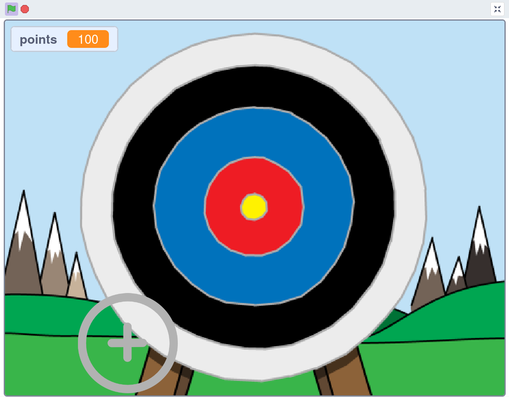
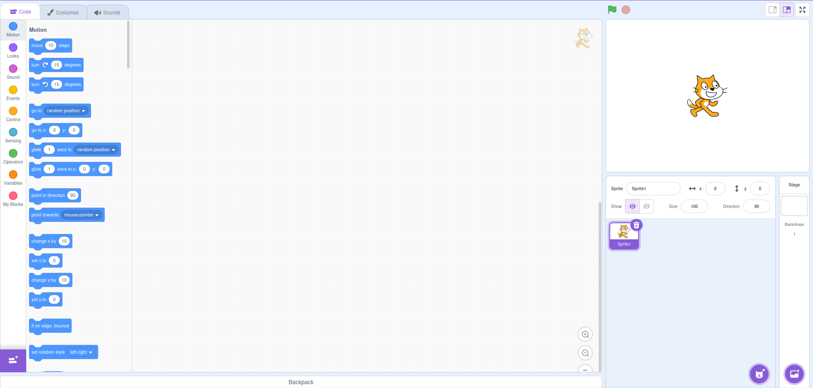
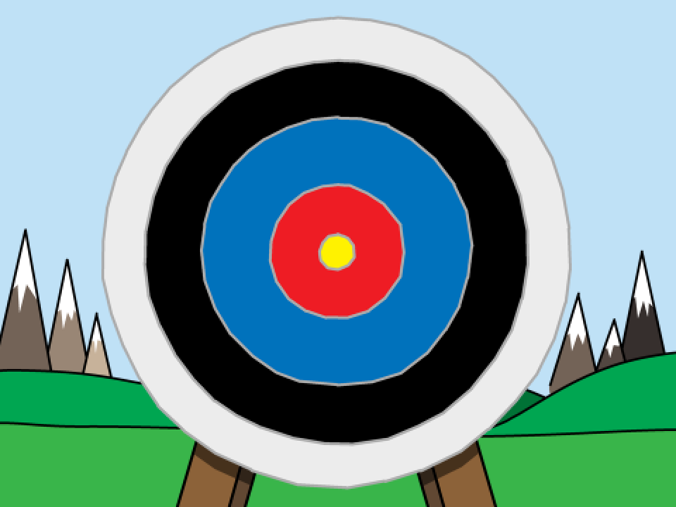
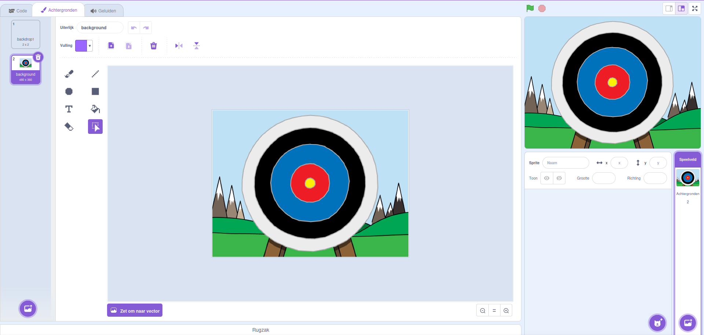
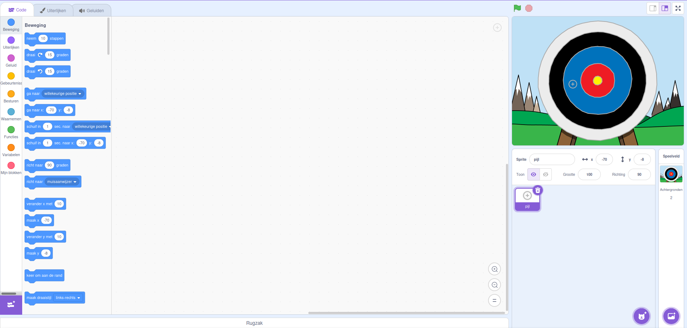
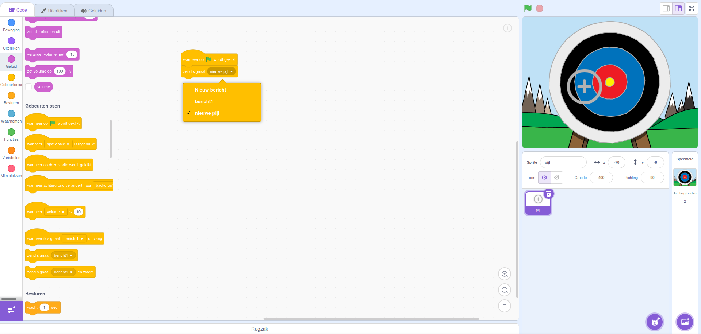
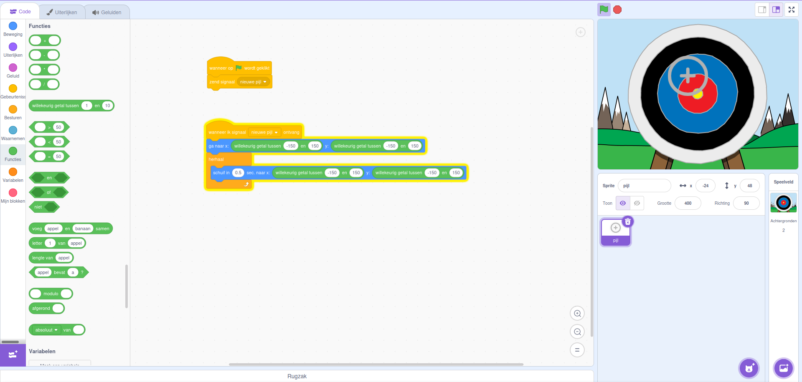
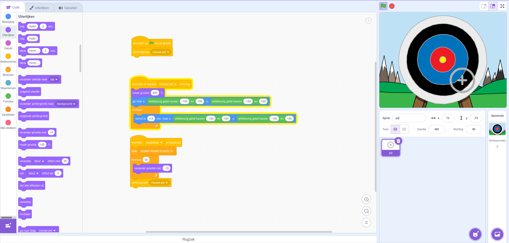
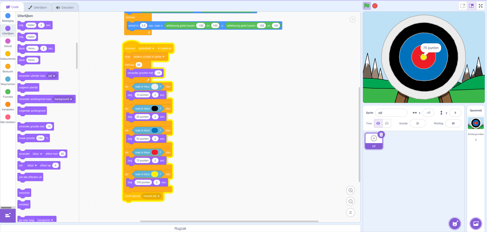
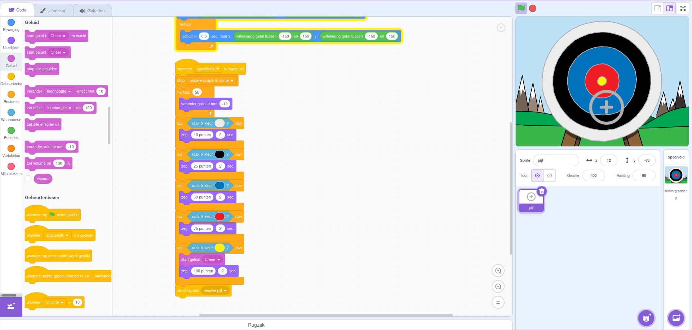

# Boogschieten

Hallo! Vandaag gaan we het spel *boogschieten* maken, met behulp van Scratch.

Scratch is een omgeving waarin we kunnen programmeren. Door blokken te slepen, kunnen we structuren maken die samen een spel vormen.

We beginnen helemaal leeg. Elke opdracht hieronder is een stukje van het spel. Aan het einde van de opdrachten heb je een spel gebouwd, waarmee je kunt boogschieten en kan tellen hoeveel punten je hebt gescoort.

Elke opdracht bevat uitleg, en dingen die jij zelf moet doen. De dingen die jij zelf moet doen, staan aangegeven met `▶▶▶`.

Als je helemaal klaar bent, zal het eindresultaat er ongeveer zo uit zien:

### Opdracht 0: Openen van Scratch

De programmeeromgeving waarin we gaan werken heet *Scratch*. Dat is een website waarop je blokken kunt slepen om een programma te maken. Het resultaat kan je direct bekijken en uitproberen!

▶▶▶ Open Scratch door op de link te klikken: https://scratch.mit.edu/projects/editor

Er zijn meerdere dingen te zien:
- Code blokken (links)
- Het veld om in te programmeren (midden)
- Het resultaat (rechterkant)

In de volgende opdrachten zullen we de blokken van de linkerkant pakken, ze in het midden neerzetten, en aan de rechterkant het resultaat bekijken.

Dat was gemakkelijk! Nu komt het echte werk!

### Opdracht 1: De achtergrond

We hebben nu in Scratch een mooi nieuw project gemaakt. We gaan hier in ons spel programmeren.

Echter heeft Scratch ons al een begin gegeven dat we eigenlijk niet willen: een kat.

▶▶▶ Klik aan de rechterkant op het icoontje van de prullenbak om te kat te verwijderen.

Nu is de omgeving echt leeg.

Laten we een mooie achtergrond maken voor ons spel. We hebben een afbeelding nodig.

▶▶▶ Klik met de rechter muisknop op de afbeelding hieronder, en selecteer *Sla afbeelding op als...*. Sla de afbeelding ergens op de computer op.

Deze afbeelding:

▶▶▶ Klik aan de rechterkant in *Speelveld* op het icoontje van *Achtergronden*, en in het uitklapmenu op *upload achtergrond*. Kies de afbeelding die je zojuist hebt gedownload.

In Scratch opent nu een scherm waarin je de achtergrond verder kunt bewerken. Dat is niet nodig.

▶▶▶ Klik aan de linkerkant op *Code* om terug te gaan naar de programmeeromgeving.

### Opdracht 2: Richten met de pijl

Met boogschieten gebruiken we een pijl om op het bord te schieten.

De pijl stellen we voor als een richtpunt.

▶▶▶ Klik met de rechter muisknop op de afbeelding hieronder, en selecteer *Sla afbeelding op als...*. Sla de afbeelding ergens op de computer op.

Met de afbeelding van de richtpunt van de pijl gaan we een *sprite* maken. Een sprite is een onderdeel van ons spel.

▶▶▶ Klik aan de rechterkant op het icoontje van de afbeeldingen. Kies in het uitklapmenu *Upload sprite*. Kies de afbeelding die je zojuist hebt gedownload.

In het scherm moet nu een pijlpunt zichtbaar zijn van de sprite die net is aangemaakt. Hij heeft automatisch de naam *pijl* gekregen.

Op de achtergrond is de pijl ook op een willekeurige plek verschenen.

We gaan de pijl iets groter maken.

▶▶▶ Vul aan de rechter kant in het veld *Grootte* het getal `400` in.

De pijl moet nu vier keer zo groot zijn als eerst.

### Opdracht 3: Bewegende pijl

Er gebeurt nog niet zoveel in ons spel. We gaan de pijl laten bewegen.

Ten eerste moeten we iets doen als het spel start.

Zodra het spel start, zetten we de pijl op een willekeurige plek.

In Scratch gebruiken we daarvoor *signalen*. Signalen geven aan dat er iets is gebeurd. In ons geval willen we een nieuwe pijl schieten, dus maken we een signaal dat `nieuwe pijl` heet.

▶▶▶ Kies aan de linker kant de categorie *Gebeurtenissen* (geel).

▶▶▶ Sleep het blok *wanneer op 🟩 wordt geklikt* in het veld.

▶▶▶ Sleep het blok *zend signaal <...>* in het veld.

▶▶▶ Kies binnen het blok *zend signaal <...>*, de optie *Nieuw bericht*, en typ `nieuwe pijl` in het tekstveld.

Nu wordt er een signaal gestuurd als het spel wordt gestart. Daar zien we alleen nog niet zoveel van.

▶▶▶ Sleep het blok *wanneer ik signaal <...> ontvang* in het veld, en maak daarmee een nieuwe groep.

▶▶▶ Selecteer in het blok *wanneer ik signaal <...> ontvang* het signaal `nieuwe pijl`.

▶▶▶ Kies aan de linker kant de categorie *Beweging* (blauw).

▶▶▶ Sleep het blok *ga naar x: <...>, y: <...>* in het veld.

▶▶▶ Kies aan de linker kant de categorie *Functies* (groen).

▶▶▶ Sleep het blok *willekeurig getal tussen <...> en <...>* op het eerste getal in het blauwe *ga naar* blok.

▶▶▶ Sleep nog een blok *willekeurig getal tussen <...> en <...>* op het tweede getal in het blauwe *ga naar* blok.

▶▶▶ Kies voor beide *willekeurig getal* blokken de getallen `-150` en `150`.

▶▶▶ Kies aan de linker kant de categorie *Besturen* (oranje).

▶▶▶ Sleep een blok *herhaal* (alleen herhaal, geen aantal of andere vakjes) in het veld.

▶▶▶ Kies aan de linker kant de categorie *Beweging* (blauw).

▶▶▶ Sleep het blok *schuif in <...> sec. naar x: <...>, y: <...>* in de binnenkant van het oranje *herhaal* blok.

▶▶▶ Zet het eerste getal in het blauwe *schuif in...* blok op `0.5`.

▶▶▶ Kies aan de linker kant de categorie *Functies* (groen).

▶▶▶ Sleep het blok *willekeurig getal tussen <...> en <...>* op het eerste getal in het blauwe *schuif in...* blok.

▶▶▶ Sleep nog een blok *willekeurig getal tussen <...> en <...>* op het tweede getal in het blauwe *schuif in...* blok.

▶▶▶ Kies voor beide *willekeurig getal* blokken de getallen `-150` en `150`.

Laten we het uitproberen! Klik op de groene vlag 🟩 om het spel te starten!

De pijl moet over het scherm heen en weer bewegen.

### Opdracht 4: Schieten

We gaan met de spatiebalk op het toetsenbord de pijl in ons spel afschieten. Weet je de spatiebalk te vinden op het toetsenbord?

In Scratch kunnen we het toetsenbord gebruiken om het spel te besturen. Voor ons spel hebben we alleen de spatiebalk nodig, maar het is mogelijk om elke toets van het toetsenbord, en zelfs de muis te gebruiken!

▶▶▶ Sleep uit de categorie *Gebeurtenissen* (geel) het blok *wanneer <...> is ingedrukt*, en maak daarmee een nieuwe groep.

Als we de spatiebalk indrukken, dan schieten we de pijl, en moet alle andere beweging stoppen.

▶▶▶ Sleep uit de categorie *Besturen* (oranje) het blok *stop <...>* in het veld. Kies daarin de optie `alle scripts in sprite`.

▶▶▶ Sleep uit de categorie *Besturen* (oranje) het blok *herhaal <...>* (met een getal) in het veld. Vul het getal `50` in voor het aantal herhalingen.

▶▶▶ Sleep uit de categorie *Uiterlijken* (paars) het blok *verander grootte met <...>* binnen de oranje herhaling. Kies `-10` als getal.

▶▶▶ Sleep uit de categorie *Gebeurtenissen* (geel) het blok *zend signaal <...>* onder (buiten) de oranje herhaling. Kies `nieuwe pijl` als signaal.

Probeer het spel te spelen. De pijl verwijnt als we hem hebben geschoten, en er komt geen nieuwe pijl meer.

Als er een nieuwe pijl komt, dan moet de grootte weer worden teruggezet naar de begingrootte.

▶▶▶ Sleep uit de categorie *Uiterlijken* (paars) het blok *maak grootte <...>* als tweede blok onder de tweede groep, net onder het blok *wanneer ik signaal `nieuwe pijl` ontvang*. Vul `400` in voor de grootte.

Probeer het spel te spelen. Nu moet elke keer als een pijl wordt afgeschoten, een nieuwe pijl worden gemaakt die opnieuw kan worden afgeschoten.

### Opdracht 5: Punten tonen

Als we een pijl hebben geschoten, dan scoren we punten.

Het aantal punten hangt af van de positie van de pijl:
- de buitenste ring, wit, scoort 10 punten
- de tweede ring, zwart, scoort 25 punten
- de derde ring, blauw, scoort 50 punten
- de vierde ring, rood, scoort 75 punten
- de binnenste ring, geel, scoort 100 punten

We gaan voor elk van deze kleuren de punten in beeld tonen.

▶▶▶ Sleep uit de categorie *Besturen* (oranje) het blok *als <...> dan* als een-na-laatste blok van de derde groep, net onder het blok *herhaal `50`*.

▶▶▶ Sleep uit de categorie *Waarnemen* (licht blauw) het blok *raak ik kleur <...>* als voorwaarde van het *als <...> dan* blok. De kleur kan worden gekozen door erop de klikken, en in het schermpje de kleurkiezer te gebruiken. Klik op de witte kleur van het boogschietdoel.

▶▶▶ Sleep uit de categorie *Uiterlijken* (paars) het blok *zeg <...> <...> sec.* binnen het *als <...> dan* blok. Kies het aantal punten dat is gescoord voor de kleur (dus 10 punten voor wit) als tekst.

▶▶▶ Herhaal bovenstaande drie stappen voor de kleuren zwart, blauw, rood en geel. Zet alle *als <...> dan* blokken onder elkaar.

Zorg ervoor dat het laatste blok in het rijtje altijd het blokje *zend signaal `nieuwe pijl`* blijft.

Probeer het spel eens uit. Afhankelijk hoe goed je de pijl richt, krijg je een ander aantal punten.

### Opdracht 6: Feest bij schieten in de roos

Het is wel erg moeilijk om de top score te halen, 100 punten!

Als het lukt om geel te raken, dan is dat wel een feestje waard 🎉.

▶▶▶ Ga naar het tabblad *Geluiden*.

▶▶▶ Op de knop linksonder, *Kies een geluid*, klik in het uitklapmenu op *Kies een geluid*.

▶▶▶ Zoek naar `cheer` en kies het geluid dat `Cheer` heet. Dat betekent juichen in het Engels.

▶▶▶ Ga terug naar het tabblad *Code*.

▶▶▶ Sleep uit de categorie *Geluid* (paars) het blok *start geluid <...>* binnen het *als <...> dan* blok als geel wordt geraakt. Kies de het `Cheer` geluid.

Probeer geel te raken met de pijl. Er moet nu hard voor je worden gejuichd, wat een feestje!

### Opdracht 7: Punten optellen

Bij een echte boogschiet wedstrijd worden de punten opgeteld die zijn geschoten. Aan het einde van de wedstrijd wint de persoon met de meeste punten.

Wij gaan in het spel ook de punten optellen.

### Extra opdracht: Wind

Deze opdracht is extra moeilijk, voor als je extra uitdaging zoekt. Niet alle stappen zijn tot in detail uitgewerkt, alleen de hooftlijnen staan uitgelegd. De blokken moet je zelf nog bedenken en invullen.

We gaan wind toevoegen aan het spel.

Wanneer je een pijl schiet, dan duwt de wind de pijl een beetje de kant op waar de wind naartoe waait.

Als de wind hard waait, dan duwt de wind de pijl verder.

